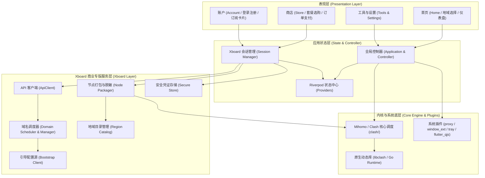

# Bettbox 架构全景与模块依赖

## 1. 架构总览

Bettbox 是一款基于 Flutter + Mihomo (Clash Meta) 内核构建的多平台网络代理与规则分流客户端，并在当前分支中深度集成了针对商业化运营自建 Xboard 面板的端到端能力。

---

## 2. 模块职责说明

| 模块路径 | 职责定位 |
| :--- | :--- |
| `lib/views/` | 页面视图层，包含首页（节点与状态展示）、商店（套餐订购与订单）、账户（用户身份与订阅详情）、设置等 |
| `lib/widgets/` | 可复用的通用 UI 组件库，支持 Material 3 与暗色/亮色自适应主题 |
| `lib/controller.dart` & `application.dart` | 核心全局控制器，协调连接状态、Profile 配置切换、托盘控制与跨端生命周期 |
| `lib/xboard/` | **商业版核心链路**： • `session.dart`：登录/登出、自动拉取与轮询套餐状态 • `domain_scheduler.dart`：多域名健康度探测与无感故障轮换 • `bootstrap.dart`：域名被封时的远端引导配置源拉取（救援模式） • `node_packager.dart`：节点商业脱敏（国家代码+序号）、组内负载均衡（load-balance / sticky-sessions）包装 • `secure_store.dart`：利用平台级安全凭证库存储 Auth Token 与敏感信息 |
| `lib/clash/` | Clash / Mihomo 内核交互，负责生成最终运行配置、下发 Core 重载、管理 TUN 网卡及读取测速延迟与流量 |
| `plugins/` | 本地化插件支持，包括系统代理设置 (`proxy`)、桌面窗口与托盘管理 (`window_ext`, `tray_manager`)、代码编辑器 (`code_forge`) 以及 JS 规则覆写 (`flutter_qjs`) |

## 3. 邀请与平台边界

`lib/xboard/invite.dart` 封装邀请统计、邀请码创建与公开注册 URL 构造。`lib/views/account/invite_page.dart` 使用随鉴权状态失效的 Riverpod 页面数据，展示四项邀请/佣金统计及二维码。既有 Xboard 模块采用手写 Provider，与该模块约定保持一致。奖励归属、计算与结算始终由服务端完成。

分享站点取自 `guest/comm/config.app_url`，币种取自 `user/comm/config.currency`。分享站点与 API 域名池分离，公开 URL 不承载登录凭据或订阅 token。邀请码创建虽然是 GET，客户端仍按有副作用操作处理，仅接受主动点击，不自动重试。邀请码/收益不跨账户缓存。

macOS 与 Windows 已有原生工程、内核管理与打包流程；商业版的实际平台可用性需独立构建和设备验证。iOS 尚无主工程，当前非 Android 内核分支走桌面服务，不能直接用于 iOS；需要 Runner、Packet Tunnel Extension、共享容器与内核通信，IAP 按 PRD 已决方案接服务端交易验证及返佣账务。详细工作包及验收见 `.agents/plans/2026-09-22-invite-and-platforms.md`。

页面和业务保持共享主线，原生平台能力分别验收。`RedirectCashier` 为 Android 保留 WebView，桌面使用系统浏览器；初始支付地址只接受 HTTPS。macOS Keychain entitlement 已按安全存储插件要求配置；本机 Xcode 27 的 SDK 支持从 macOS 12.0 开始的部署目标。桌面候选编译入口为 `scripts/validate_desktop.py`，执行位置及产物由 `.pdec/contract.yaml` 登记。邀请内存集成验证和各平台完成边界见 `docs/PLATFORM_VALIDATION.md`。
