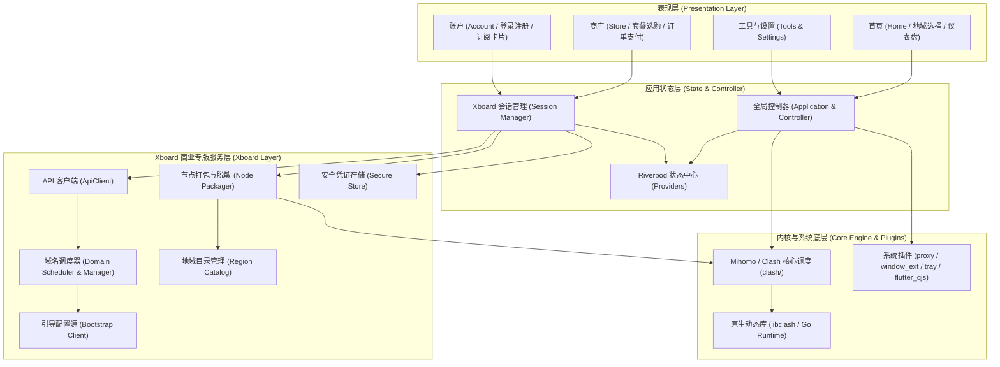

# Bettbox 架构全景与模块依赖

## 1. 架构总览

Bettbox 是一款基于 Flutter + Mihomo (Clash Meta) 内核构建的多平台网络代理与规则分流客户端，并在当前分支中深度集成了针对商业化运营自建 Xboard 面板的端到端能力。

```mermaid
flowchart TD
    subgraph UI["表现层 (Presentation Layer)"]
        HomeView["首页 (Home / 地域选择 / 仪表盘)"]
        StoreView["商店 (Store / 套餐选购 / 订单支付)"]
        AccountView["账户 (Account / 登录注册 / 订阅卡片)"]
        ToolsSetting["工具与设置 (Tools & Settings)"]
    end

    subgraph StateApp["应用状态层 (State & Controller)"]
        AppController["全局控制器 (Application & Controller)"]
        RiverpodState["Riverpod 状态中心 (Providers)"]
        XboardSession["Xboard 会话管理 (Session Manager)"]
    end

    subgraph XboardLayer["Xboard 商业专版服务层 (Xboard Layer)"]
        ApiClient["API 客户端 (ApiClient)"]
        DomainScheduler["域名调度器 (Domain Scheduler & Manager)"]
        BootstrapClient["引导配置源 (Bootstrap Client)"]
        NodePackager["节点打包与脱敏 (Node Packager)"]
        RegionCatalog["地域目录管理 (Region Catalog)"]
        SecureStore["安全凭证存储 (Secure Store)"]
    end

    subgraph CoreEngine["内核与系统底层 (Core Engine & Plugins)"]
        ClashCore["Mihomo / Clash 核心调度 (clash/)"]
        GoKernel["原生动态库 (libclash / Go Runtime)"]
        Plugins["系统插件 (proxy / window_ext / tray / flutter_qjs)"]
    end

    HomeView --> AppController
    StoreView --> XboardSession
    AccountView --> XboardSession
    ToolsSetting --> AppController

    AppController --> RiverpodState
    XboardSession --> RiverpodState
    XboardSession --> ApiClient
    XboardSession --> NodePackager
    XboardSession --> SecureStore

    ApiClient --> DomainScheduler
    DomainScheduler --> BootstrapClient
    NodePackager --> RegionCatalog

    AppController --> ClashCore
    NodePackager --> ClashCore
    ClashCore --> GoKernel
    AppController --> Plugins
```

---

## 2. 模块职责说明

| 模块路径 | 职责定位 |
| :--- | :--- |
| `lib/views/` | 页面视图层，包含首页（节点与状态展示）、商店（套餐订购与订单）、账户（用户身份与订阅详情）、设置等 |
| `lib/widgets/` | 可复用的通用 UI 组件库，支持 Material 3 与暗色/亮色自适应主题 |
| `lib/controller.dart` & `application.dart` | 核心全局控制器，协调连接状态、Profile 配置切换、托盘控制与跨端生命周期 |
| `lib/xboard/` | **商业版核心链路**： • `session.dart`：登录/登出、自动拉取与轮询套餐状态 • `domain_scheduler.dart`：多域名健康度探测与无感故障轮换 • `bootstrap.dart`：域名被封时的远端引导配置源拉取（救援模式） • `node_packager.dart`：节点商业脱敏（国家代码+序号）、组内负载均衡（load-balance / sticky-sessions）包装 • `secure_store.dart`：利用平台级安全凭证库存储 Auth Token 与敏感信息 |
| `lib/clash/` | Clash / Mihomo 内核交互，负责生成最终运行配置、下发 Core 重载、管理 TUN 网卡及读取测速延迟与流量 |
| `plugins/` | 本地化插件支持，包括系统代理设置 (`proxy`)、桌面窗口与托盘管理 (`window_ext`, `tray_manager`)、代码编辑器 (`code_forge`) 以及 JS 规则覆写 (`flutter_qjs`) |

## 3. 邀请与平台边界

`lib/xboard/invite.dart` 封装邀请统计、邀请码创建与公开注册 URL 构造。`lib/views/account/invite_page.dart` 使用随鉴权状态失效的 Riverpod 页面数据，展示四项邀请/佣金统计及二维码。既有 Xboard 模块采用手写 Provider，与该模块约定保持一致。奖励归属、计算与结算始终由服务端完成。

分享站点取自 `guest/comm/config.app_url`，币种取自 `user/comm/config.currency`。分享站点与 API 域名池分离，公开 URL 不承载登录凭据或订阅 token。邀请码创建虽然是 GET，客户端仍按有副作用操作处理，仅接受主动点击，不自动重试。邀请码/收益不跨账户缓存。

macOS 与 Windows 已有原生工程、内核管理与打包流程；商业版的实际平台可用性需独立构建和设备验证。iOS 使用独立 Runner、Packet Tunnel Extension、共享容器与内嵌内核通信，平台映射不启动桌面 Process；IAP 按 PRD 接服务端交易验证及返佣账务，当前尚未完成交易实现与真实验收。详细工作包及验收见 `.agents/plans/2026-10-07-three-platform-release.md`。

页面和业务保持共享主线，原生平台能力分别验收。`RedirectCashier` 为 Android 保留 WebView，桌面使用系统浏览器；初始支付地址只接受 HTTPS。macOS Keychain entitlement 已按安全存储插件要求配置；本机 Xcode 27 的 SDK 支持从 macOS 12.0 开始的部署目标。桌面候选编译入口为 `scripts/validate_desktop.py`，执行位置及产物由 `.pdec/contract.yaml` 登记。邀请内存集成验证和各平台完成边界见 `docs/PLATFORM_VALIDATION.md`。

## 4. 服务端运行链路

Xboard 与 CloudBridgeRelay 部署在 NoSLA `216.23.116.56`。Cloudflare 橙云直接连接 Caddy 443/8443，再转到回环 7001；网页入口为 cloud.bingcn.site，API/订阅为 api.bingcn.site，cloud.microsoftnexushub.top:8443 保留既有客户端兼容，origin.bingcn.site 用于直连运维。相关橙云主机名使用严格 TLS 规则和 DNS-01 公开可信证书。数据库、Redis、插件及辅助 Mihomo 位于 NoSLA；腾讯云仅保留回滚数据和过渡转发，无业务写入。详见 [服务端部署说明](SERVER_DEPLOYMENT.md)。

## 共享网络信任边界

`lib/xboard/url_policy.dart` 统一验证面板 HTTPS 根地址及引导 HTTPS 地址，拒绝 URL 凭据、控制字符、异常端口和不适用的路径/查询。域名调度更新保留实际活动地址，不因远端列表顺序变化错误切换。API 和引导关闭自动重定向，避免跨源转发授权头或降级传输；需要迁移入口时由已校验引导配置显式提供地址。API 非 2xx 状态先于业务包络判定，服务端错误不伪装为成功，副作用请求不自动重试。订阅同步日志与连接错误不携带秘密 URL。

Android 发行构建必须具备完整签名配置，JNI 构建必须具备目标 ABI 内核及头文件。缺失输入直接失败；debug 开发构建和正式发行验收独立。

## macOS 系统代理事务

macOS 系统代理事务核心位于 `plugins/proxy/macos/Classes/Core/`，通过类型化字段组、所有权 journal 契约和串行生命周期处理启动与恢复。真实 SCPreferences/journal 适配器及 Flutter channel 尚未接入，现有 networksetup 路径仍待替换；核心测试入口与真实系统验收分别登记，见 `.agents/plans/2026-10-07-macos-proxy-transactions.md`。

## iOS 内嵌内核边界

`core/lib_ios.go` 提供不依赖 Dart VM 的有界 C Action RPC、包流输入/输出与生命周期状态。`core/iosbridge` 将裸 IPv4/IPv6 包注入真实 Mihomo gVisor listener；普通 Android/桌面 listener 入口保持原有行为。状态观察不等待生命周期锁，超时不会强制结束尚未完成的内核操作，调用方不能把停止请求或超时当成停止完成。

Runner 与 Packet Tunnel 工程已接入该内核，NE 网络设置、系统状态与受保护 App Group 快照分别实现。arm64 模拟器完整构建、页面导航及7项原生测试通过；真机签名与系统 VPN 尚未验收。Apple Packet Tunnel 用途限制须结合当前规则代理与监听行为核验，工程可编译不作为分发许可证据。
