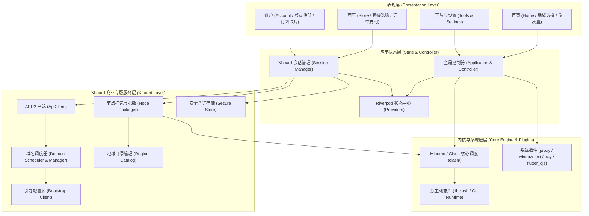

# Bettbox 架构全景与模块依赖

账户输入边界：登录、注册、找回密码的邮箱与密码，以及注册邀请码显式关闭输入法纠错、候选建议、智能横线及引号替换；密码显示状态保持相同限制。键盘类型、无障碍标签与邮箱自动填充保留；实际提交及安全存储继续由现有 Xboard 会话与 SecureStore 管理。

## 1. 架构总览

Bettbox 是一款基于 Flutter + Mihomo (Clash Meta) 内核构建的多平台网络代理与规则分流客户端，并在当前分支中深度集成了针对商业化运营自建 Xboard 面板的端到端能力。

```mermaid
flowchart TD
    subgraph UI["表现层 (Presentation Layer)"]
        HomeView["首页 (Home / 地域选择 / 仪表盘)"]
        StoreView["商店 (Store / 套餐选购 / 订单支付)"]
        AccountView["账户 (Account / 登录注册 / 订阅卡片)"]
        ToolsSetting["工具与设置 (Tools & Settings)"]
    end

    subgraph StateApp["应用状态层 (State & Controller)"]
        AppController["全局控制器 (Application & Controller)"]
        RiverpodState["Riverpod 状态中心 (Providers)"]
        XboardSession["Xboard 会话管理 (Session Manager)"]
    end

    subgraph XboardLayer["Xboard 商业专版服务层 (Xboard Layer)"]
        ApiClient["API 客户端 (ApiClient)"]
        DomainScheduler["域名调度器 (Domain Scheduler & Manager)"]
        BootstrapClient["引导配置源 (Bootstrap Client)"]
        NodePackager["节点打包与脱敏 (Node Packager)"]
        RegionCatalog["地域目录管理 (Region Catalog)"]
        SecureStore["安全凭证存储 (Secure Store)"]
    end

    subgraph CoreEngine["内核与系统底层 (Core Engine & Plugins)"]
        ClashCore["Mihomo / Clash 核心调度 (clash/)"]
        GoKernel["原生动态库 (libclash / Go Runtime)"]
        Plugins["系统插件 (proxy / window_ext / tray / flutter_qjs)"]
    end

    HomeView --> AppController
    StoreView --> XboardSession
    AccountView --> XboardSession
    ToolsSetting --> AppController

    AppController --> RiverpodState
    XboardSession --> RiverpodState
    XboardSession --> ApiClient
    XboardSession --> NodePackager
    XboardSession --> SecureStore

    ApiClient --> DomainScheduler
    DomainScheduler --> BootstrapClient
    NodePackager --> RegionCatalog

    AppController --> ClashCore
    NodePackager --> ClashCore
    ClashCore --> GoKernel
    AppController --> Plugins
```

---

## 2. 模块职责说明

| 模块路径 | 职责定位 |
| :--- | :--- |
| `lib/views/` | 页面视图层，包含首页（节点与状态展示）、商店（套餐订购与订单）、账户（用户身份与订阅详情）、设置等 |
| `lib/widgets/` | 可复用的通用 UI 组件库，支持 Material 3 与暗色/亮色自适应主题 |
| `lib/controller.dart` & `application.dart` | 核心全局控制器，协调连接状态、Profile 配置切换、托盘控制与跨端生命周期 |
| `lib/xboard/` | **商业版核心链路**： • `session.dart`：登录/登出、自动拉取与轮询套餐状态 • `domain_scheduler.dart`：多域名健康度探测与无感故障轮换 • `bootstrap.dart`：域名被封时的远端引导配置源拉取（救援模式） • `node_packager.dart`：节点商业脱敏（国家代码+序号）、组内负载均衡（load-balance / sticky-sessions）包装 • `secure_store.dart`：利用平台级安全凭证库存储 Auth Token 与敏感信息 |
| `lib/clash/` | Clash / Mihomo 内核交互，负责生成最终运行配置、下发 Core 重载、管理 TUN 网卡及读取测速延迟与流量 |
| `plugins/` | 本地化插件支持，包括系统代理设置 (`proxy`)、桌面窗口与托盘管理 (`window_ext`, `tray_manager`)、代码编辑器 (`code_forge`) 以及 JS 规则覆写 (`flutter_qjs`) |

## 3. 邀请与平台边界

`lib/xboard/invite.dart` 封装邀请统计、邀请码创建与公开注册 URL 构造。`lib/views/account/invite_page.dart` 使用随鉴权状态失效的 Riverpod 页面数据，展示四项邀请/佣金统计及二维码。既有 Xboard 模块采用手写 Provider，与该模块约定保持一致。奖励归属、计算与结算始终由服务端完成。

分享站点取自 `guest/comm/config.app_url`，币种取自 `user/comm/config.currency`。分享站点与 API 域名池分离，公开 URL 不承载登录凭据或订阅 token。邀请码创建虽然是 GET，客户端仍按有副作用操作处理，仅接受主动点击，不自动重试。邀请码/收益不跨账户缓存。

macOS 与 Windows 已有原生工程、内核管理与打包流程；商业版的实际平台可用性需独立构建和设备验证。iOS 使用独立 Runner、Packet Tunnel Extension、共享容器与内嵌内核通信，平台映射不启动桌面 Process；IAP 按 PRD 接服务端交易验证及返佣账务，当前尚未完成交易实现与真实验收。详细工作包及验收见 `.agents/plans/2026-10-07-three-platform-release.md`。

页面和业务保持共享主线，原生平台能力分别验收。`RedirectCashier` 为 Android 保留 WebView，桌面使用系统浏览器；初始支付地址只接受 HTTPS。macOS Keychain entitlement 已按安全存储插件要求配置；本机 Xcode 27 的 SDK 支持从 macOS 12.0 开始的部署目标。桌面候选编译入口为 `scripts/validate_desktop.py`，执行位置及产物由 `.pdec/contract.yaml` 登记。邀请内存集成验证和各平台完成边界见 `docs/PLATFORM_VALIDATION.md`。

## 4. 服务端运行链路

Xboard 与 CloudBridgeRelay 部署在 NoSLA `216.23.116.56`。Cloudflare 橙云直接连接 Caddy 443/8443，再转到回环 7001；网页入口为 cloud.bingcn.site，API/订阅为 api.bingcn.site，cloud.microsoftnexushub.top:8443 保留既有客户端兼容，origin.bingcn.site 用于直连运维。相关橙云主机名使用严格 TLS 规则和 DNS-01 公开可信证书。数据库、Redis、插件及辅助 Mihomo 位于 NoSLA；腾讯云仅保留回滚数据和过渡转发，无业务写入。详见 [服务端部署说明](SERVER_DEPLOYMENT.md)。

## 共享网络信任边界

`lib/xboard/url_policy.dart` 统一验证面板 HTTPS 根地址及引导 HTTPS 地址，拒绝 URL 凭据、控制字符、异常端口和不适用的路径/查询。域名调度更新保留实际活动地址，不因远端列表顺序变化错误切换。API 和引导关闭自动重定向，避免跨源转发授权头或降级传输；需要迁移入口时由已校验引导配置显式提供地址。API 非 2xx 状态先于业务包络判定，服务端错误不伪装为成功，副作用请求不自动重试。订阅同步日志与连接错误不携带秘密 URL。

Android 发行构建必须具备完整签名配置，JNI 构建必须具备目标 ABI 内核及头文件。缺失输入直接失败；debug 开发构建和正式发行验收独立。

JNI 链接的 Go 核心没有 SONAME，CMake 显式声明该属性以避免把构建路径写入依赖。APK 的动态段须唯一映射到实际文件范围，依赖只接受 basename，`libcore.so` 必须依赖 `libclash.so`；核心原字节 SHA 与16KB对齐检查分别保留。系统钥匙串由 security 读取固定条目，项目密钥及回执保持0600，禁止他人写入钥匙串文件，不改变系统 ACL。

## macOS 系统代理事务

macOS 系统代理事务核心位于 `plugins/proxy/macos/Classes/Core/`，通过类型化字段组、所有权 journal 契约和串行生命周期处理启动与恢复。SystemConfiguration与受保护journal候选已实现，但 Flutter channel 尚未接入，现有 networksetup 路径仍待替换；核心测试入口与真实系统验收分别登记，见 `.agents/plans/2026-10-07-macos-proxy-transactions.md`。

## iOS 内嵌内核边界

`core/lib_ios.go` 提供不依赖 Dart VM 的有界 C Action RPC、包流输入/输出与生命周期状态。`core/iosbridge` 将裸 IPv4/IPv6 包注入真实 Mihomo gVisor listener；普通 Android/桌面 listener 入口保持原有行为。状态观察不等待生命周期锁，超时不会强制结束尚未完成的内核操作，调用方不能把停止请求或超时当成停止完成。

Runner 与 Packet Tunnel 工程已接入该内核，NE 网络设置、系统状态与受保护 App Group 快照分别实现。arm64 模拟器完整构建、页面导航及7项原生测试通过；真机签名与系统 VPN 尚未验收。Apple Packet Tunnel 用途限制须结合当前规则代理与监听行为核验，工程可编译不作为分发许可证据。

### macOS 专用 HTTP 入口

Mihomo fork 提供 `NewCredentialBlindLoopback`，仅固定本机临时端口，不读取订阅认证配置；保留目标 Authorization，移除代理认证 Header/Trailer，不提供 SOCKS。连接、内部路由与 EOF watcher 纳入所有权，关闭等待不足返回未完成。默认入口认证与 InUser 归属保持兼容。该模块尚未接入宿主或系统代理，不能据此开放原生认证门禁；匿名管道身份与代次验收单独实施。

macOS Go核心提供独占子进程匿名管道入口 `--owned-pipe-v1`。固定HELLO/ACK、协议和代次绑定，单调期限核验准入，业务结果捕获所属会话；控制FD为FIFO且CLOEXEC，业务日志转stderr。入口失败或发送失败撤销，内部restart副作用前拒绝；逻辑撤销不冒充操作结束，宿主需观察captured child实际退出码。旧UDS/TCP保留兼容格式，但macOS发行接线须使用可信匿名管道与原生身份验证，不能因核心入口存在而采用原共享IPC/root路径。

客户端运行状态由state包私有RWMutex保护；`Snapshot()`返回AccessControl/列表的深复制，`ApplyJSON()`在副本解析成功后原子提交，保留有效部分更新、unknown字段与nil/空列表语义。畸形输入固定错误且不部分提交，action通道回传固定字符串；Android/iOS profile及流量/选项读取统一使用快照。Android快速启动的完整错误和TUN状态回传由启动合同验收。

### Android 快速配置预检

`core/androidstartup.QuickStart` 按初始化、客户端状态、配置顺序执行。任一前置失败立即返回固定错误，禁止继续配置；Android adapter 只发送一次返回值。该预检不提交 VPN 启动状态，VPN 建立、原生资源和跨引擎取消由独立启停合同验收。

### Android 启停资源基础逻辑

`core/androidstartup.State` 串行管理运行时间、listener 和 callback lease，资源关闭未确认时保留所有权并拒绝下一次启动。`CallbackGate` 在等待并发许可之前登记回调，关闭准入会取消排队者；`Shutdown` 等待已进入的回调结束后恰一次释放引用，并保存首次关闭错误。Android 的 FDLease 接管 Service 经 detachFd 移交的输入；未采纳输入只关闭一次，关闭首错永久阻断启停，不重试可能复用的数字 FD。

Go Android adapter 已接入 State、CallbackGate、Shutdown 和 FDLease；配置快照释放 runLock 后才取得生命周期锁，构造错误贯穿 startTUN 返回值。Kotlin 通过显式领取租约区分 JNI 前后所有者，启动、停止及 protect 均传回 Boolean。真实 ARM64 Go 核心及 JNI 编译链接通过；Service 的代际保护、完整 Android 工程和设备行为单独验收，helper 结果不能替代系统 VPN 或底层栈停止证据。

### macOS core 最终身份

`macos_core_identity.py` 是固定 core 的共享 ad hoc 签名入口。签名前拒绝链接与特殊文件；允许系统签名在同一父目录中正常替换 inode，随后重新 no-follow 打开最终文件。独立验签、公开元数据读取及持 FD 摘要计算期间禁止路径、inode 和内容漂移。公开清单只有固定 schema、identifier、CDHash、SHA256 和 signingmode。

桌面验证入口先签 core 再冻结 SHA；`setup.dart` 的 macOS App 打包也调用该入口并传递最终 SHA。Runner 复制 core 时不二次签名，同时复制身份清单；bundle 验证核对封装字节、清单及最终签名。宿主关闭 Xcode 签名不跳过 core 身份准备。legacy `--dev` 的 core 名称与 App 固定产物不一致，App 打包明确拒绝该组合。ad hoc 是开发身份事实，不代表 Developer ID 或公证发行资格；签后路径检查也不构成同 UID 攻击的硬隔离。

### macOS 子进程回收边界

当前Dart运行时的全局退出线程可能回收同宿主内非Dart登记的child，实际短时夹具已复现。因此新增原生POSIX child owner不能仅以“不向Dart交PID”承诺唯一wait/reap。生产接线必须统一回收，或把Core放入没有竞争reaper的固定可信父进程；宿主身份、Core父属、匿名管道及退出事实分别验证。隔离Swift宿主fixture只能证明自己的执行范围。当前客户端仍使用既有Dart Process路径，新的原生生命周期链尚未集成。

Android 配置与启停目标使用同一operation Mutex及独立配置journal；已开始的同步写入不能随请求取消而丢失归属。未确认副作用完成时保留恢复状态，只有实际Applied派生options可进入启动。候选helper的30项JVM验证已通过；同步JNI和所有配置写入口接线尚未实施，当前客户端不能视为已采用此合同。

真实调用层尚将原生请求受理布尔值当作完成：前台、后台智能切换及磁贴缺少关联终态回执。联合计划见 `.agents/plans/2026-10-08-android-owner-integration.md`，以既有唯一owner的typed completion投影到请求回执，区分stateRevision与configRevision；Dart仅在确认终态后提交展示和持久状态。f881880正式APK已通过完整编译、验签和安装来源核验，直连模式下本机HTTP代理、浏览器HTTPS及两轮TUN/监听启动停止通过；上游代理另验，因此不表示该联合合同已经采用。

TCP/UDP隧道构造器在任何端口绑定前校验目标地址，无效目标不创建socket；合法目标的绑定及错误传递保持原接口。此输入副作用边界已有生产构造器race回归，监听器整体Close、provider及运行状态确认独立验收。

## 专用入口与检查式关闭

Darwin owned pipe现已安装私有会话capability，提供固定空参数的ownedHttpStart/Stop/Get。专用入口只绑定127.0.0.1随机端口，generation与单调listenerEpoch共同标识；配置生命周期先确认关闭入口，再同步实际配置处理。成功init不会清除shutdown或配置拒绝后的失效状态，只有有效setup/update可恢复准入。legacy传输不能获得capability；Go准入不等于Apple身份认证，Dart/supervisor/SDK/SC接线尚未完成。

StopListenerChecked使用各资源真实重建锁，覆盖ordinary、inbound和TCP/UDP tunnel登记资源。Close失败或panic返回固定失败并保留归属，继续其它关闭；只在真实nil后清引用。此API未替换默认StopListener，也不能证明连接排空或完整VPN stack退出；Android平台所有者仍需撤销重建入场后消费。

### macOS supervisor 原生模块

`macos/CoreSupervisor` 包含Security/内核身份链、固定产物发行器、独占子进程生命周期、非阻塞relay和宿主六ABI。Host只发行native路径与不透明handle；Dart负责唯一helper Process，Core由无Dart的helper创建、信号与精确回收。SDK单worker不持意图锁，期限与整链出生在提交点核对；未知资源保留所有权。

控制帧为4KiB，业务帧为10MiB；连续credit为写入流控，不代表RPC完成。HUP、半帧、背压和退出分别处理，缓存丢弃固定失败。`lib/clash/supervisor` 已提供生产Session及17项行为测试，Runner窗口已持有固定宿主桥，六份Host/Identity源加入实际编译。ClashService的macOS分支已使用该通道与有界RPC；helper与身份清单已纳入封装；SC事务需原生联合接线。

`scripts/check_macos_supervisor.py` 编译实际生产helper并运行身份/owner/relay/host验证。公开签名夹具通过真实宿主ABI和生产helper交换framed消息并确认停止；它的Core不是Mihomo，也不验证完整Flutter应用或系统代理。来源和实际执行证据见 `validation/2026-10-07-three-platform/macos-supervisor-integration-validation.json`。

真实Mihomo专用入口已与生产helper/native host完成签名身份链、HELLO/ACK、`getIsInit`及EOF退出验证，native确认本代出生消失；这项独立App验证不覆盖应用主流程或业务流量。回执为 `validation/2026-10-07-three-platform/macos-runner-real-go-validation.json`。

macOS arm64生产helper通过当前SDK编译、固定ad hoc签名后复制入App，复制阶段不重签；源/bundle字节与清单/公开签名共同核验。本机候选封装先签嵌套叶级Mach-O与framework，最终签宿主并严格核验完整bundle，保留unsigned源App作为构建证据。候选位于 `build/macos-local-candidate/Bettbox.app`，不是DeveloperID或公证发行；共享setup只允许已验证arm64，使用锁定Pod依赖并准备helper。

真实Flutter探针入口为 `integration_test/macos_supervisor_probe.dart`，通过生产MethodChannel、Session、helper与固定真实Go Core连续完成两代getIsInit。每代16个公开true子进程分别确认exit和双管道EOF；Session停止确认helper exit0、控制EOF与native出生消失，最终宿主exit0。未确认所有者保留且禁止新代次。驱动明确冻结两个探针输入摘要，独立签名候选只用于探针，正常App按完整文件摘要恢复。50项macOS工具测试、158项Flutter测试与静态分析通过；回执为 `docs/validation/2026-10-07-three-platform/macos-flutter-supervisor-validation.json`。

探针ad hoc签名不携带entitlements，不加载账户、配置或系统代理。正常候选保留Release钥匙串权利；实际系统AMFI曾拒绝带受限entitlements的ad hoc探针，即使严格验签通过。ClashService、SC事务、Keychain冷启动及有效订阅流量尚待联合验收；完整可分发应用尚未交付。

macOS应用接线：ClashService通过生产Application/Session/RPC管理启动、重启、请求、就绪和停止，不创建旧控制socket、不直接启动/终止Core、不进行legacy fallback。含就绪等待最多8个请求，重启排队最多8个；RPC结果序列化预算16MiB，单事件1MiB，异步事件批次最多32个且序列化预算16MiB。事件监听器的Future返回值可观察，失败与全部结束分别跟踪，未知任务不能被Coregone清洗。回执 `docs/validation/2026-10-07-three-platform/macos-application-supervisor-validation.json` 确认真实Flutter两代Application/RPC、32个公开child及native停止，181项Flutter测试与静态分析通过；正常main的登录、SC与有效流量另验。

macOS预检恢复：`confirmPreflightStopped(generation)` 只在原生SDK worker结束、同代ticket撤销且停止、reservation未发行且无helper/Core记录时确认。Session没有launch/exit/worker才消费证据，超时保留worker；已发行reservation与未知状态拒绝清理。当前184项Flutter测试和静态分析、host生产typecheck及确定性交错测试通过；实际Application/Session重试的native/transport为fixture，未重新执行签名Flutter探针或正常main。回执 `docs/validation/2026-10-07-three-platform/macos-preflight-recovery-validation.json`。

macOS系统代理后端候选：SystemConfiguration使用当前NetworkSet、非等待配置锁、独立Commit/Apply和运行Proxies双读；白名单合并保留认证及未知键，PAC/WPAD仅写启用位，HTTP-only事务不写SOCKS并拒绝其启用/未知运行状态。当前34项Swift测试及真实SDK只读数量验收通过，未改变配置签名；仅有动态Proxies字典不证明网络或代理流量。真实服务认证均unknown，start被拒绝；生产journal候选见下文；native消费授权、Flutter注册与实际写入/恢复尚未实现验收。HTTP-only journal为schema3，旧2拒绝自动恢复。回执 `docs/validation/2026-10-07-three-platform/macos-sc-backend-validation.json`。

macOS受保护journal候选：native固定路径、0700目录/0600单链接文件、ACL与路径inode校验、生命周期flock及稳定安装owner ID；schema3采用有界canonical JSON。临时文件先fsync/F_FULLFSYNC再原子发布，目录同步失败保留未知状态并拒绝重用backend。新建或重新打开的完整目录链同步自身和父目录后才发布owner ID。46项Swift测试覆盖真实文件与跨进程锁、损坏拒绝和fake配置恢复；未接入正常App，也不声称抵抗同UID或root篡改。回执 `docs/validation/2026-10-07-three-platform/macos-protected-journal-validation.json`。

受限协议诊断入口为 `core/cmd/nodeprobe`，通过当前Mihomo适配器直接请求固定HTTPS目标，无监听、系统路由或代理配置写入。`scripts/probe_node_subscription.py` 仅使用受保护开发账户，禁止重定向，抽样最多4节点；秘密输入只在进程内存/stdin传递，输出固定类别和匿名序号。子进程总预算45秒，所有异常路径回收并关闭管道；诊断不替代Android VPN或macOS系统代理验收。输入与进程治理测试及执行项登记于PDEC。

原生FD构造合同：`sing_tun.NewWithNativeFDOwnership` 只接受正FD与必填同步采纳回调，返回Listener、初始化错误及首个cleanup错误，保留原Stack选择。部分资源清理失败时将Listener及首错一起保留；调用者不得再次关闭同一数字FD或用第二次Close清洗错误。Android Service实际通过detachFd移交，不保留原FD；JNI前取消由Kotlin局部租约负责；JNI领取后移交Go，NativeTun登记后同步采纳。完整服务代际保护待验收。监听器入口的8项测试与独立复审通过，未证明有效设备构造或完整启动。

Android Service 启停由生产 VpnWorkGate 串行覆盖 establish、重试、JNI 消费及未交接FD收尾；stop先撤销票据再等待工作结束。每次绑定采用独立ServiceConnection及注册票据，权限、超时与断连回调不能借用新启动意图。持久停止标记只在主进程经真实Core.stopTun确认后解除；通知使用局部Builder，共享速度及已发布状态在固定service/generation末端门禁提交。公开协程屏障复现旧establish未完成却确认STOP的红例，修复后两个生产gate/controller夹具入口通过；独立回审原4项静态闭合。完整Android工程、Binder、SharedPreferences和设备通知性能另验。

JNI 初始化逐项检查class/globalref/method与pending exception；加载失败统一回收String globalref并清除方法IDs。字符串构造成功后才进入Java callback，失败返回固定结果，不描述原始异常。生产helper与真实JNI_OnLoad的9项公开函数表故障夹具通过，实际ARM64链接通过；不等同于实际JVM、CheckJNI或线程attach验收。

macOS系统代理事务核心使用schema4：启动依赖不可反序列化的credential-blind能力，保留unknown认证事实并拒绝已识别present；服务级持久与运行未拥有字段摘要分别守卫SOCKS、认证、PAC URL及未知配置。verified恢复在stage后、commit前再次检查运行侧，外部变化时保留原journal且不提交；部分组冲突不阻断其他组的受限恢复。旧schema3严格canonical读取，不能自动升级为新能力。61项实际Swift测试和独立复审通过，回执为 `validation/2026-10-07-three-platform/macos-sc-schema4-validation.json`；正常宿主/Dart接线及真实写入、恢复、流量尚未验收。

macOS Session在revoke与stdin关闭前要求原生recoverSystemProxy返回idle/restored且零未解决组；恢复失败保留资源。底层恢复Future保留直到真实结束，每个调用者独立有界等待，pending时拒绝activate。专用入口回包与原生SC结果精确解析，不能把端点参数当Ticket/proof授权。24项Session和5项解析通过，回执 `validation/2026-10-07-three-platform/macos-session-recovery-gate-validation.json`；正常Application配置/收尾顺序与Host迟到activate撤销尚待联合验收。

macOS正常应用由SupervisorApplication统一排队运行、代理偏好、配置及退出，ClashService不使用旧startListener/stopListener RPC。ProxyManager只转交代理开关及bypass变化，不根据UI运行布尔反向启动或调用networksetup。界面启停仅按实际确认更新运行时间；退出先等待恢复与owner收尾成功，再结束托盘及窗口，失败保留界面可重试。该应用接线的隔离回归与完整Runner验证见PLATFORM_VALIDATION。

冷恢复在独占受保护journal后严格判空，可信nil免SC锁；读取/身份/所有权未知仍失败。已投递SC start的completion单独跟踪，未settle时safe recover降格为recoveryRequired，迟到applied不恢复授权，必须显式重试恢复。

macOS系统代理事务通过内部AuthorizedSCSessionFactory取得原生AuthorizationRef及默认配置域SCPreferences；仅使用空rights、空environment和默认flags。原生资源同步按SDK返回、同步/解锁、session释放、授权引用释放后回包，不将授权引用传到Dart/journal。部分创建或关闭失败优先返回recoveryRequired并在该owner实例粘性阻断，不能用空journal抹除未知关闭结果。start在授权前、锁返回后及运行双读后检查当前能力；提交中撤销仍按原补偿责任处理。实际OS授权及SC生效独立验收。

### 配置准备与发布

Go setupConfig持有runLock，通过cloneSetupParams复制调用输入、prepareSetupConfigLocked建立局部候选、commitSetupConfigLocked发布并应用。准备失败保留已发布配置指针和原默认探测URL；复制保持既有tolerance数值转换语义。Mihomo ParseRawConfig仍会临时修改General并可能触及geodata及持久fake-IP缓存，准备层不提供全资源回滚。Android统一提交需在调用解析器前标ENTERED，以epoch/revision绑定options与TUN采纳；该联合接线尚待验收。

Android同步配置中间层：Go生产入口以runLock执行epoch/revision CAS、STAGED初始状态、ENTERED准备/提交及同次options深副本；回执严格区分staged/applied/rejected/unknown，未知保留责任并粘滞阻断。JNI同步桥及Kotlin严格十字段codec已实现，但未接入唯一Native owner。Core全包、state race、实际Kotlin JVM、NDK28/API26 ARM64 Go/JNI编译及17项JNI函数表ASAN验证通过；真实Android JVM/CheckJNI、带版本TUN准入、HTTP/FFI旁路收敛、epoch换代、完整App及业务验收另验。回执 `docs/validation/2026-10-07-three-platform/android-owned-config-validation.json`。

Android TUN资源状态由 `androidstartup.State` 锁内StartReport表达，兼容bool仅从同次报告派生；报告在输入收口完成后生成，清理未知粘滞阻断，确认Close之前保留已启动runtime。RetainsLease仅表明State的可达指针责任。CallbackGate Shutdown保留首个listener错误，等待pin后安全转换release panic，重复关闭不能清洗失败。该模块尚未提供带配置版本的Android TUN ABI。

macOS宿主签名与启动准入分别验收。当前封装器未实现provisioning profile信任和权利授权链，完整候选任何非空权利配置均提前拒绝；无权利公开探针单独保留。签后读取实际权利核对预检快照，清单固定launch_validated=false。真实App的DP Keychain权利保持，匹配profile由Xcode签名方案承载。

Android注册JNI回调释放ABI为int，非空对象仅状态1代表合法DeleteGlobalRef调用无异常及任务线程finish确认；0未Delete，2后置或已有线程责任未知。Go通过ConfirmJNIRelease与现有OnceLease受捕获错误边界保持失败，不重试删除。JNI helper仅EDETACHED附着，nullable env短路；Detach失败保存本库生命周期atomic未知责任，后续成功不能清洗。Protect/Resolve以同次finish判定结果，返回解析字符串始终malloc所有权或nullptr。依据[JNI函数规范](https://docs.oracle.com/en/java/javase/26/docs/specs/jni/functions.html#deleteglobalref)与[线程规范](https://docs.oracle.com/en/java/javase/24/docs/specs/jni/invocation.html#getenv)，不能将void API伪造为VM内部删除回执。TUN版本准入采用配置reservation/锁外构造合同，禁止runLock跨Java回调或drain等待；该接线尚未完成。

Android 配置协调器提供同一配置锁内的 TUN 预留：绑定 epoch/configRevision、复制 options，预留期间 commit 在 ENTERED 前拒绝。启动回执未知及停止未确认保留预留并粘滞阻断；干净失败和确认停止才解除。构造与回调等待必须在配置锁外。该模块尚未接入实际 TUN/JNI 与唯一 Native owner，旧配置旁路和客户端错误码契约仍待收敛。

Android State 的 `RejectInputWithCleanup` 独立清理未进入构造的新输入，不停止旧资源或修改旧 runtime。关闭错误或 panic、回调释放 panic 转换为固定首因并粘滞阻断；释放失败保留 pending lease。输入完成与 State 已有 blocked 责任分别报告。回调不得重入 State；真实启动接线和设备验收独立完成。

Android TUN预留固定同次VPN模式：VPN成功须进入构造并保留resource/lease；非VPN fd0成功仅有running且无三项责任。两者不可互相冒充，options消费者修改不能改变已固定模式。实际唯一owner尚未接入生产VpnPlugin。
